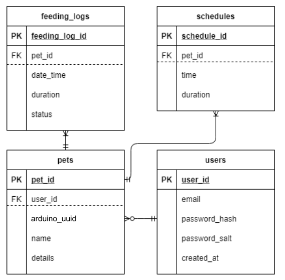
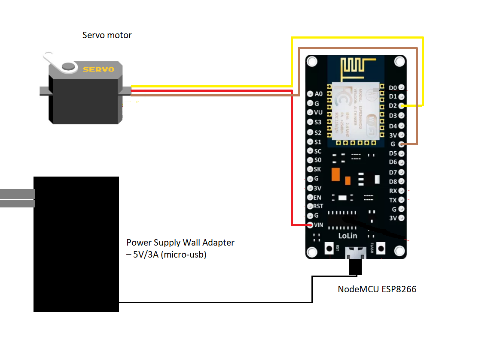

# Treats

A web application that offers a service to individuals to remotely feed their pets by will or their daily set schedules. It must be supplemented by a pet feeder machine that can be easily built using an ESP8266 and a servo motor. 

## Diagrams

**Database**

**Diagram**

## Deployment

For the database hosting and the web application, it was all done with the help of Azure services (https://azure.microsoft.com/en-us/).
Active site here (https://it-treats.azurewebsites.net/)

## Major technologies used

* [MySql](https://www.mysql.com/) - database
* [Express](https://expressjs.com/) - web framework
* [Node.js](https://nodejs.org/en/) - server
* [WebSockets] - communication between the Arduino and server
* [cron] - time-based job scheduler 

## Authors

* **Earl Augusto**  - [SpookyGlitches](https://github.com/SpookyGlitches)
* **Neal Bolano**  - [Amadeus](https://github.com/amadeus6969)
* **Jonard Pesquera**  - [OnatP](https://github.com/OnatP)
* **Philippe Tan**  - [philippetan](https://github.com/philippetan)

## Acknowledgments

* npm packages used
* Arduino libraries used
* (https://stackoverflow.com/posts/62867363/revisions) - snippet code used for the websockets in the server